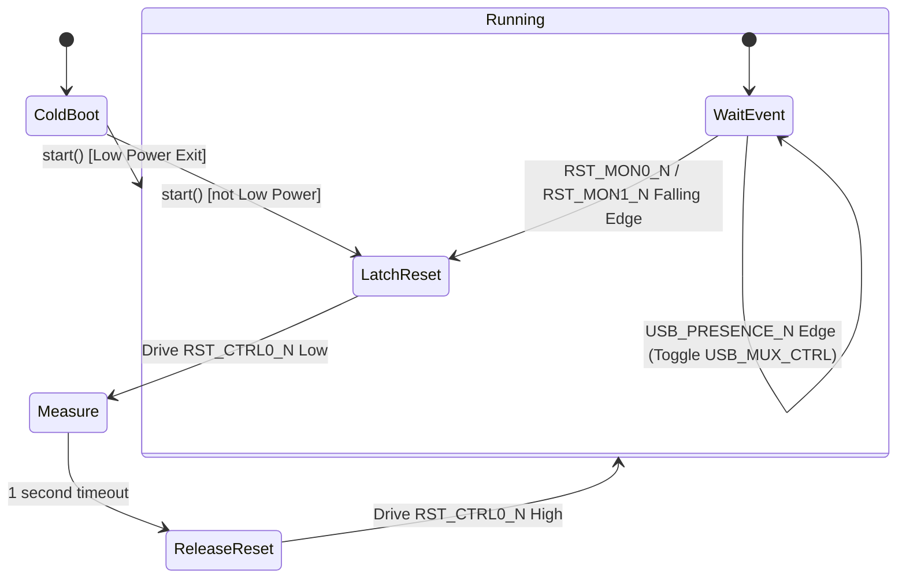

# Earlgrey Platform Service

The Platform Service is a core service running in the Earlgrey Hardware Enablement (HWE) firmware. It is responsible for managing hardware strap pins, system reset monitoring and execution, and USB routing.

## Overview

The Platform Service performs the following key functions:
1.  **Software Strap Configuration**: Reads the 3-bit hardware strap pins on boot using a robust dual-read procedure and reports the combined 6-bit value to the System Manager (`sysmgr`).
2.  **Reset Execution**: Controls the system reset line `RST_CTRL0_N` to latch, measure (for 1 second), and release the target system reset.
3.  **Reset Monitoring**: Monitors the reset monitor lines (`RST_MON0_N` and `RST_MON1_N`) for falling edges, triggering a new reset sequence if a reset request is detected.
4.  **USB routing**: Monitors the USB presence line (`USB_PRESENCE_N`) and dynamically switches the USB Mux (`USB_MUX_CTRL`) to route USB signals appropriately.

## Hardware Mappings

The service interacts with the following pins (mapped via GPIO and Pinmux):
*   **Reset Control**: `RST_CTRL0_N` (Pin 0 / Pad `IOA0`). `RST_CTRL1_N` (Pin 1 / Pad `IOA1`) is reserved as a backup.
*   **Reset Monitors**: `RST_MON0_N` (Pin 17 / Pad `IOA2`) and `RST_MON1_N` (Pin 18 / Pad `IOA5`).
*   **USB Presence**: `USB_PRESENCE_N` (Pin 16 / Pad `IOR11`).
*   **USB Mux**: `USB_MUX_CTRL` (Pin 7 / Pad `IOC6`).
*   **Software Straps**: `SW_STRAP0` (Pin 22 / Pad `IOC0`), `SW_STRAP1` (Pin 23 / Pad `IOC1`), `SW_STRAP2` (Pin 24 / Pad `IOC2`).
*   **SPI Mux/Reset (Cold Boot only)**:
    *   `SPI_MUX_CTRL` (Pin 4 / Pad `IOB8`)
    *   `SPI_MUX_EN_N` (Pin 3 / Pad `IOB7`)
    *   `SPI_RESET_N` (Pin 2 / Pad `IOA7`)
    *   `SPI_HOST0_WP_N` (Pin 5 / Pad `IOA3`)
    *   `SPI_HOST1_WP_N` (Pin 6 / Pad `IOA6`)

## Startup Sequence

Upon starting, the Platform Service executes the following sequence:
1.  Initializes the Pinmux and GPIO drivers.
2.  Performs the **Strap Reading Procedure** (see below) to determine the software strap value.
3.  Sends the strap value to `sysmgr` via the `set_software_straps` IPC.
4.  Retrieves `BootInfo` from `sysmgr`.
5.  Configures interrupts on the reset monitors (`RST_MON0_N`, `RST_MON1_N`) and USB presence (`USB_PRESENCE_N`).
6.  Checks the reset reason in `BootInfo`:
    *   If it is a **Low Power Exit**, the service transitions directly to the `Running` state.
    *   If it is a **Cold Boot** (or any other reason), the service configures the SPI GPIOs (driving `SPI_MUX_CTRL` low, `SPI_MUX_EN_N` low, and releasing resets) and enters the `LatchReset` state to perform a target reset.

## Strap Reading Procedure

Strap pins are read using a two-pass procedure to ensure stability and filter out noise:
For each strap pin $i \in \{0, 1, 2\}$:
1.  Configure `SW_STRAPi` pin with **no pull**.
2.  Delay for 50 microseconds (`PINMUX_PROP_DELAY`).
3.  Read the pin value -> `val1` (0 or 1).
4.  Configure the pin pull **opposite** to `val1` (if `val1 == 0` -> pull `Up`, if `val1 == 1` -> pull `Down`).
5.  Delay for 50 microseconds.
6.  Read the pin value again -> `val2` (0 or 1).
7.  The 2-bit result for this pin is `(val1 << 1) | val2`.

The final 6-bit software strap value is constructed by combining the results:
$$\text{strap\_value} = (\text{strap2} \ll 4) \mid (\text{strap1} \ll 2) \mid \text{strap0}$$

## State Machine

The platform service state machine coordinates target reset execution and runtime event handling.

### States
*   **ColdBoot**: Initial state. Performs startup initialization, strap reading, and decides whether to perform a reset based on the boot reason.
*   **LatchReset**: Asserts the target reset by driving `RST_CTRL0_N` Low.
*   **Measure**: Waits for 1 second to ensure the reset is registered by the target system.
*   **ReleaseReset**: De-asserts the target reset by driving `RST_CTRL0_N` High.
*   **Running**: Main loop. Listens for interrupts:
    *   `RST_MON0_N` / `RST_MON1_N` falling edge: Transitions back to `LatchReset` to execute a reset.
    *   `USB_PRESENCE_N` edge: Updates the `USB_MUX_CTRL` output (High on unplug/rising edge, Low on plug-in/falling edge).
